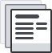

<h2 class="my-450">Start using GC Design System</h2>

<article class="py-600 bg-primary text-light bg-full-width">
  <gcds-grid tag="ul" columns="1fr" columns-tablet="1fr 1fr">
    <li class="list-none md:mb-0 mb-600">
      
      <h3 class="mt-0">Design experiences</h3>
      
Explore design assets in our Figma library.

      <a class="link-light" href="{{ links.getStartedDesignSection }}">
        Start designing
      </a>
    </li>
    <li class="list-none">
      
      <h3 class="mt-0">Develop products</h3>
      
Install the component package.

      <a class="link-light" href="{{ links.getStartedDevelopSection }}">Start developing</a>
    </li>
  </gcds-grid>
</article>

<article class="pb-600">
  <h2>A design system just for you</h2>
  
Take a look around. <gcds-link href="{{ links.contact }}">Tell us what you think</gcds-link>.

  <gcds-grid tag="ul" columns="1fr" columns-tablet="1fr 1fr" columns-desktop="1fr 1fr 1fr">
    <li class="list-none">
      
      <h3 class="mt-0">Components</h3>
      
User interface building blocks address different user objectives.

      
Select reusable code for common components, paired with best practice advice, for the framework you're using.

      <gcds-link href="{{ links.components }}">View components</gcds-link>
    </li>
    <li class="list-none">
      
      <h3 class="mt-0">Page templates</h3>
      
Reusable page layouts combine components into common page types.

      
Start your project with basic, pre-built pages that provide a consistent, recognizable Canada.ca experience.

      <gcds-link href="{{ links.pageTemplates }}">Browse page templates</gcds-link>
    </li>
    <li class="list-none">
      
      <h3 class="mt-0">Design tokens</h3>
      
Brand and design decisions built into code.

      
Learn how encoded decisions shape the design of government services for a consistent visual experience.

      <gcds-link href="{{ links.styles }}">View tokens</gcds-link>
    </li>
  </gcds-grid>
</article>

<article class="py-600 bg-light bg-full-width">
  <h2 class="mt-0">What's new</h2>
  <gcds-grid tag="ul" columns="1fr" columns-tablet="1fr 1fr">
    <gcds-card
      href="{{ links.shortcuts }}"
      card-title="Style with CSS Shortcuts "
      card-title-tag="h3"
      description="Add GC Design System CSS styling shortcuts to your custom code."
      role="listitem"
    ></gcds-card>
    <gcds-card
      href="{{ links.accessibility }}"
      card-title="Find out about accessibility"
      card-title-tag="h3"
      description="Review accessibility practices and checks within the design system."
      role="listitem"
    ></gcds-card>
    <gcds-card
      href="{{ links.registerDemo }}"
      card-title="Attend a demo"
      card-title-tag="h3"
      description="Learn how GC Design System can work for you and your team and get your questions answered."
      role="listitem"
    ></gcds-card>
    <gcds-card
      href="{{ links.releaseNotes }}"
      card-title="Catch up on releases"
      card-title-tag="h3"
      description="Read about the latest additions and features."
      role="listitem"
    ></gcds-card>
  </gcds-grid>
</article>

<article class="pb-600">
  <h2>Featured components</h2>
  <gcds-grid tag="ul" columns="1fr" columns-tablet="1fr 1fr" columns-desktop="1fr 1fr 1fr">
    <gcds-card
      href="{{ links.notice }}"
      card-title="Notice"
      card-title-tag="h3"
      img-src="/images/common/components/preview-notice.svg"
      img-alt="A blue vertical line truncated at the top by a blue circle, representing the guide line and icon, sits to the left of a stack of three thick grey lines. The top dark grey line represents the heading and the other two represent the lines of text."
      description="Notice is a messaging component to communicate updates, warnings, and confirmations related to the main task on the page or the service. It’s a short, prominent message that’s part of the page content."
      role="listitem"
    ></gcds-card>
    <gcds-card
      href="{{ links.card }}"
      card-title="Card"
      card-title-tag="h3"
      img-src="/images/common/components/preview-card.svg"
      img-alt="The card component shows a box containing a rectangular image in the top half. Immediately below is a blue rectangular bar running across three quarters of the box representing the card title. Two longer grey bars are stacked just below the blue bar, representing the card description and context area/metadata sections."
      description="A card is a navigation component that can be used instead of a button or link to highlight the most prominent action. It’s a box containing structured, actionable content on a single topic."
      role="listitem"
    ></gcds-card>
  </gcds-grid>
</article>
