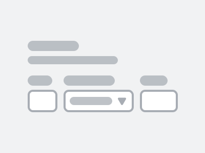

<h2 class="py-450">Commencez à utiliser Système de design GC</h2>

<article class="py-500 bg-primary text-light bg-full-width">
  <gcds-grid tag="ul" columns="1fr" columns-tablet="1fr 1fr" gap="450">
    <li class="list-none md:mb-0 mb-500">
      
      <h3 class="mb-400">Concevoir des expériences</h3>
      
Visitez notre bibliothèque Figma pour explorer nos ressources de conception.

      <a class="link-light" href="{{ links.figma }}" target="_blank">
        Commencer à concevoir
        <gcds-icon name="external-link" label="S'ouvre dans un nouvel onglet." margin-left="50" />
      </a>
    </li>
    <li class="list-none">
      
      <h3 class="mb-400">Développer des produits</h3>
      
Installez l'ensemble de composants.

      <a class="link-light" href="{{ links.installation }}">Commencer à développer</a>
    </li>
  </gcds-grid>
</article>

<article class="py-450">
  <h2 class="mb-400">Un système de design rien que pour vous</h2>
  
Explorez notre outil de conception. <gcds-link href="{{ links.contact }}">Donnez-nous votre avis</gcds-link>.

  <gcds-grid tag="ul" columns="1fr" columns-tablet="1fr 1fr" columns-desktop="1fr 1fr 1fr" gap="450">
    <li class="list-none">
      
      <h3 class="mb-400">Composants</h3>
      
Les blocs de construction de l'interface utilisateur servent différents objectifs.

      
Sélectionnez du code réutilisable pour les composants courants et obtenez des conseils relatifs aux meilleures pratiques pour l'infrastructure que vous utilisez.

      <gcds-link href="{{ links.components }}">Découvrez les composants</gcds-link>
    </li>
    <li class="list-none">
      
      <h3 class="mb-400">Modèles de page</h3>
      
Les mises en page réutilisables sont des agencements de composants propres à des types de page communs.

      
Entamez votre projet à l’aide de pages de base préfabriquées pour offrir une expérience Canada.ca uniforme et reconnaissable.

      
Développement en cours

    </li>
    <li class="list-none">
      
      <h3 class="mb-400">Unités de style</h3>
      
Des décisions en matière d'image de marque et de conception directement intégrées dans le code.

      
Découvrez comment les décisions encodées façonnent la conception des services offerts par le gouvernement du Canada et permettent d'offrir une expérience visuelle uniforme.

      <gcds-link href="{{ links.styles }}">Découvrez les unités de style</gcds-link>
    </li>
  </gcds-grid>
</article>

<article class="py-500 bg-light bg-full-width">
  <h2 class="mb-400">Nouveautés</h2>
  <gcds-grid tag="ul" columns="1fr" columns-tablet="1fr 1fr" gap="450">
    <li class="list-none bg-white p-450 b-radius-md">
      <h3 class="mb-400">
        <gcds-link href="{{ links.getInvolved }}">S'impliquer</gcds-link>
      </h3>
      
Découvrez ce sur quoi nous travaillons.

    </li>
    <li class="list-none bg-white px-250 py-450 b-radius-md">
      <h3 class="mb-400">
        <gcds-link external href="{{ links.releaseNotes }}">Notes de publication</gcds-link>
      </h3>
      
Les derniers ajouts.

    </li>
  </gcds-grid>
</article>

<article class="py-450">
  <h2 class="mb-400">Composant vedette</h2>

  <h3 class="mb-400">Carte</h3>
  
La carte est un encadré contenant du contenu structuré et pratique sur un sujet unique.

  
  <gcds-link href="{{ links.card }}">En savoir plus sur la carte</gcds-link>

  <h3 class="mt-500 mb-400">Champ de date</h3>
  
Le champ de date est un espace permettant de saisir une date connue.

  
  <gcds-link href="{{ links.dateInput }}">En savoir plus sur le champ de date</gcds-link>
</article>
