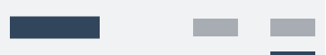

<h2 class="py-450">Bienvenue dans votre système de design</h2>

<article class="py-500 bg-primary text-light bg-full-width">
  <gcds-grid tag="ul" columns="1fr" columns-tablet="1fr 1fr" gap="450">
    <li class="list-none md:mb-0 mb-500">
      
      <h3 class="mb-400">Concevoir des expériences</h3>
      
Visitez notre bibliothèque Figma pour explorer nos ressources de conception.

      <a class="link-light" href="{{ links.figma }}" target="_blank">
        Commencer à concevoir
        <gcds-icon name="external-link" label="S'ouvre dans un nouvel onglet." margin-left="50" />
      </a>
    </li>
    <li class="list-none">
      
      <h3 class="mb-400">Développer des produits</h3>
      
Installez l'ensemble de composants.

      <a class="link-light" href="{{ links.installation }}">Commencer à développer</a>
    </li>
  </gcds-grid>
</article>

<article class="py-450">
  <h2 class="mb-400">Un système de design rien que pour vous</h2>
  
Explorez notre outil de conception. <a class="link-default" href="/fr/contactez/">Donnez-nous votre avis</a>.

  <gcds-grid tag="ul" columns="1fr" columns-tablet="1fr 1fr" columns-desktop="1fr 1fr 1fr" gap="450">
    <li class="list-none">
      
      <h3 class="mb-400">Composants</h3>
      
Les blocs de construction de l'interface utilisateur servent différents objectifs.

      
Sélectionnez du code réutilisable pour les composants courants et obtenez des conseils relatifs aux meilleures pratiques pour l'infrastructure que vous utilisez.

      <a class="link-default" href="{{ links.components }}">Découvrez les composants</a>
    </li>
    <li class="list-none">
      
      <h3 class="mb-400">Configurations</h3>
      
Des conseils pour associer les composants afin de résoudre un problème et d'améliorer votre service.

      
Commencez à concevoir des produits pour le GC et découvrez comment les mots et les interactions s'associent pour créer du sens.

      
Développement en cours

    </li>
    <li class="list-none">
      
      <h3 class="mb-400">Unités de style</h3>
      
Des décisions en matière d'image de marque et de conception directement intégrées dans le code.

      
Découvrez comment les décisions encodées façonnent la conception des services offerts par le gouvernement du Canada et permettent d'offrir une expérience visuelle uniforme.

      <a class="link-default" href="{{ links.foundations }}">Découvrez les unités de style</a>
    </li>
  </gcds-grid>
</article>

<article class="py-500 bg-light bg-full-width">
  <h2 class="mb-400">Nouveautés</h2>
  <gcds-grid tag="ul" columns="1fr" columns-tablet="1fr 1fr" columns-desktop="1fr 1fr 1fr" gap="450">
    <li class="list-none bg-white px-250 py-450 b-radius-md">
      <h3 class="mb-400"><a class="link-inherit" href="{{ links.releaseNotes }}" target="_blank">Notes de publication <gcds-icon name="external-link" label="Opens in a new tab." margin-left="50" /></a></h3></a></h3>
      
Les derniers ajouts.

    </li>
    <li class="list-none bg-white px-250 py-450 b-radius-md">
      <h3 class="mb-400"><a class="link-inherit" href="{{ links.comingSoon }}">Prochainement</a></h3>
      
Ce sur quoi nous travaillons.

    </li>
  </gcds-grid>
</article>

<article class="py-450">
  <h2 class="mb-400">Composant vedette</h2>
  <h3 class="mb-400">Barre de navigation supérieure</h3>
  
Une barre de navigation supérieure est une liste horizontale de liens de page. Utilisez une barre de navigation supérieure pour aider une personne à se repérer sur votre page Web ou site Web.

  
  <a href="{{ links.topNav }}">En savoir plus sur la barre de navigation supérieure</a>
</article>
